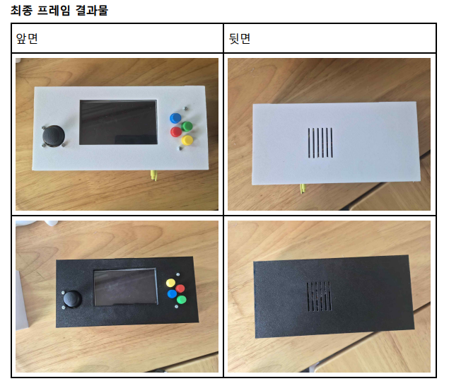
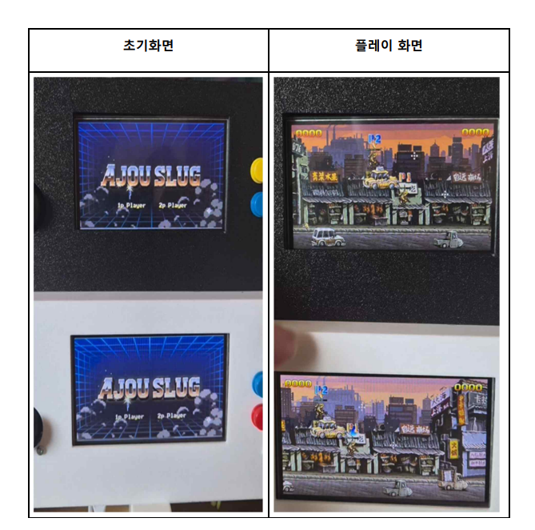

# AJOU SLUG — 유무선 통신을 활용한 2D 핸드헬드 게임기

STM32H735G-DK 보드 위에서 직접 하드웨어 초기화부터 구현한 2D 액션 게임입니다.
LTDC/DMA2D 기반 렌더링, HyperRAM·외부 Flash를 활용한 더블 버퍼링, WM8994 오디오 코덱을
이용한 실시간 사운드 믹싱, ESP32 무선 통신을 통한 1P-2P 실시간 멀티플레이까지 순수
C/HAL 기반으로 직접 구현했습니다.

개발 기간: (2026.04 ~ 2026.06)

<br>

## 📸 데모

| 최종 프레임 결과물 | 실행 화면 |
|---|---|
|  |  |


[](https://www.youtube.com/watch?v=PHyjKRZSHyI)
▲ 1인 플레이 영상

[](https://www.youtube.com/watch?v=EDpf-8gRcfU)
▲ 2인 플레이 영상 (무선 멀티플레이)

<br>

## 🎮 주요 기능

- 조이스틱(ADC+DMA) / 버튼(GPIO) 입력 기반 캐릭터 조작
- 그리드 기반 AABB 충돌 처리 (플레이어, 장애물, 아이템, 총알)
- DMA2D 하드웨어 가속 텍스처 렌더링 및 알파 블렌딩
- HyperRAM 기반 더블 프레임버퍼로 화면 티어링 제거
- WM8994 오디오 코덱 + SAI/DMA 기반 다중 채널(최대 10개) 실시간 사운드 믹싱
- ESP32 무선(WiFi UDP) 기반 1P-2P 실시간 멀티플레이

<br>

## 🛠 기술 스택

| 분류 | 내용 |
|---|---|
| Language | C |
| MCU | STM32H735G-DK (Cortex-M7) |
| Peripheral | ADC(DMA), GPIO, LTDC, DMA2D, OCTOSPI, SAI, USART/UART(DMA) |
| Memory | 내장 SRAM(D1~D3), 외부 HyperRAM(OCTOSPI2), 외부 NOR Flash MX25LM51245G(OCTOSPI1) |
| Audio | WM8994 오디오 코덱 (22kHz / 16bit / Stereo) |
| Wireless | ESP32(Arduino) — WiFi SoftAP/Station, UDP |
| Tool | STM32CubeMX, STM32CubeIDE, LCD Image Converter |

<br>

## 📁 폴더 구조

```
├── Core
│   ├── Inc                  # 헤더 (게임 로직 + STM32 설정)
│   │   ├── player.h / collision.h / render.h / network.h / sound.h ...
│   │   ├── resource/         # 텍스처·사운드 리소스 헤더
│   │   └── stm32h7xx_hal_conf.h
│   └── Src                  # 소스
│       ├── main.c            # 페리페럴 초기화 (ADC/LTDC/DMA2D/OCTOSPI 등)
│       ├── player.c / collision.c / render.c / network.c / sound.c ...
│       └── resource/         # 텍스처·사운드를 C 배열로 변환한 리소스 데이터
└── STM32H735IGKX_FLASH.ld    # 링커 스크립트 (HyperRAM/Flash 메모리 영역 직접 추가)
```

> `Drivers/`(STM32 HAL 라이브러리, CMSIS)는 ST 공식 제공 코드로 본 저장소에는
> 포함하지 않았습니다. `Core/Src/resource/`는 이미지·오디오 파일을 C 배열로 변환한
> 리소스 데이터이며, 실제 게임 로직은 그 외 파일들입니다.

<br>

## 🔍 핵심 구현

### 1. ADC 샘플링 타임 최적화 (조이스틱 입력 안정화)

샘플링 타임을 낮게 설정하면 조이스틱 값이 깨지거나 보드가 정지하는 문제가 있었습니다.
데이터시트 기준 클럭 Prescaler와 샘플링 타임 조합(24.5 / 47.5 / 92.5 / 247.5 cycles)을
직접 실험해 최종적으로 가장 안정적인 **247.5 cycles**로 확정했습니다.

```c
hadc3.Init.ClockPrescaler = ADC_CLOCK_ASYNC_DIV4;
sConfig.SamplingTime = ADC_SAMPLETIME_247CYCLES_5;
```

### 2. HyperRAM 기반 더블 프레임버퍼 & 화면 티어링 해결

두 번째 프레임버퍼를 내부 RAM에 추가로 잡으면 용량 초과로 빌드에 실패했습니다.
OCTOSPI2로 외부 HyperRAM을 연결해 두 번째 프레임버퍼로 사용하고, DMA2D가 렌더링 중인
버퍼와 LTDC가 출력 중인 버퍼를 서로 교차 지정해 화면 찢김 없이 렌더링되도록 했습니다.

```c
uint16_t* framebuffers[2] = { framebuffer0, framebuffer1 }; // SRAM / HyperRAM
HAL_LTDC_SetAddress(&hltdc, framebuffers[back_buffer_idx], 0);
HAL_LTDC_Reload(&hltdc, LTDC_RELOAD_VERTICAL_BLANKING);
```

### 3. ESP32 무선 구간 대용량 패킷 분할 수신 해결

WiFi UDP 특성상 1,500byte 이상 데이터가 두 번에 나뉘어 도착해 1,979byte 초기 동기화
패킷이 정상적으로 조립되지 않는 문제가 있었습니다. 수신측에서 offset을 누적 카운팅해
목표 패킷 크기(1,979 / 369byte)에 도달할 때까지 버퍼에 조립한 뒤 STM32로 전달하도록
구조를 변경했습니다.

```c
int readSize = udpLarge.read(assembleBuffer + currentOffset, sizeof(assembleBuffer) - currentOffset);
currentOffset += readSize;
if (currentOffset == PKT_SYNC_INIT_SIZE) {
    Serial1.write(assembleBuffer, currentOffset);   // STM32로 전달
    currentOffset = 0;
}
```

### 4. 데이터시트 기반 외부 Flash(OPI) 명령어 초기화

외부 NOR Flash를 Octal I/O 모드로 쓰려면 SPI 예제에는 없는 전용 명령어 바이트를
데이터시트에서 직접 찾아 채워야 했습니다. Read Status/Config, Octal Read 커맨드를
분석해 Read-only OPI 초기화 시퀀스를 구성하고, 링커 스크립트에서 `NOLOAD` 옵션으로
불필요한 초기화를 막아 부트로더 충돌 문제까지 해결했습니다.

```c
sCommand.Instruction = 0x05FA;        // OCTAL_READ_STATUS_REG_CMD
sCommand.InstructionMode = HAL_OSPI_INSTRUCTION_8_LINES;
sCommand.InstructionDtrMode = HAL_OSPI_INSTRUCTION_DTR_ENABLE;
```

### 5. UART 패킷 부분 수신 문제 해결

`UARTx_RxEventCallback`이 패킷이 절반만 도착해도 호출되어 동기화 데이터가 반씩
쪼개져 처리되는 문제가 있었습니다. 자체 정의한 패킷에 헤더(`0xAA55`)·테일(`0xEE`)을
추가해 유효성을 검증하고, Half-Transfer 인터럽트를 비활성화해 패킷 전체가 도착했을
때만 콜백이 호출되도록 재구성했습니다.

```c
__HAL_DMA_DISABLE_IT(huart1.hdmarx, DMA_IT_HT);
// header/tail 검증 후에만 유효 패킷으로 처리
if (rx_buffer[0]==0xAA && rx_buffer[1]==0x55 && rx_buffer[size-1]==0xEE) { ... }
```

<br>

## 📌 저장소 안내

이 저장소에는 **직접 작성한 게임 로직 코드(Core/Inc, Core/Src)와 링커 스크립트만**
올려두었습니다. 프로젝트를 실제로 동일하게 재현하려면 아래 항목은 이 코드와 별개로
추가 진행이 필요합니다.

- 외부 Flash 메모리(OCTOSPI1) External Loader 등록 및 부트로더 설정
  (`MX25LM51245G_STM32H735G-DK.stldr` 적용, Debug 설정에서 Enable/Initialize 체크)
- STM32 HAL 드라이버(`Drivers/`) 및 CMSIS 등 ST 공식 라이브러리 파일 추가
  (본 저장소에는 포함하지 않았으며, STM32CubeMX로 STM32H735G-DK 타겟 프로젝트 생성 시
  자동으로 구성됩니다)
- `.ioc` 설정을 통한 ADC/LTDC/DMA2D/OCTOSPI/SAI/UART 페리페럴 재설정
- ESP32(Arduino) 무선 통신 코드는 이 저장소에 포함되어 있지 않으며, STM32와는
  별도로 ESP32 보드에 직접 구성해야 합니다. 통신 프로토콜(헤더/테일 검증, 패킷
  조립 방식)은 위 **핵심 구현 3번** 코드를 참고하시면 됩니다.
